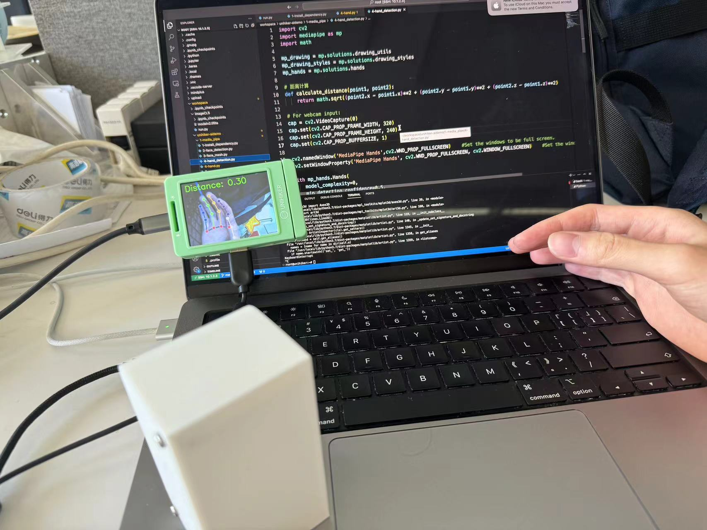
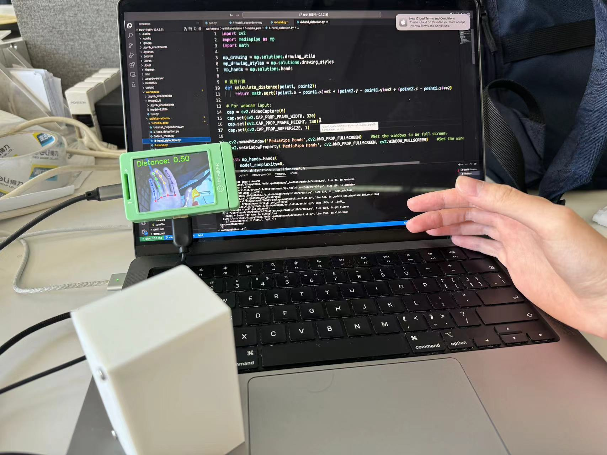

# Mind+& Google MediaPipe库引申demo汇总

## Introduction

本仓库基于Mind+(行空板)在Google MediaPipe开源框架[[文档]](https://ai.google.dev/edge/mediapipe/solutions/guide)[[GitHub]](https://github.com/google-ai-edge/mediapipe)的基础上进行开发的`unihiker-aidemo`[[Gitee]](https://gitee.com/unihiker/unihiker-aidemo)(下称原仓库)的基础上进行了二次开发。主要收纳了`demo1`, `demo2`, `demo3`等几个项目，详细介绍与文档如下。

**注意：**环境配置和初始化请参考行空板文档和`unihiker-aidemo`仓库[[说明文档]](https://www.unihiker.com.cn/wiki/ai_project)[[Gitee]](https://gitee.com/unihiker/unihiker-aidemo)

## Overview

| 名称              | 介绍                                                         | 文档                     | 程序                                          |
| ----------------- | ------------------------------------------------------------ | ------------------------ | --------------------------------------------- |
| 手势识别+风扇启停 | 本案例基于原仓库的`4-hand.py` demo进行二次开发。主要实现了基于手指位置判断基础上的手势识别，并且可以根据手势控制风扇的启停 | [doc](#手势识别风扇启停) | [code](demo/gesture_reco_fan/gesture_reco.py) |
|                   |                                                              |                          |                                               |

## 手势识别+风扇启停

### 效果展示

